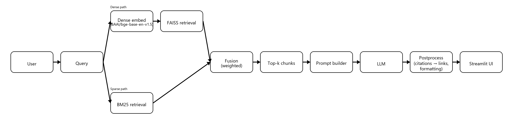
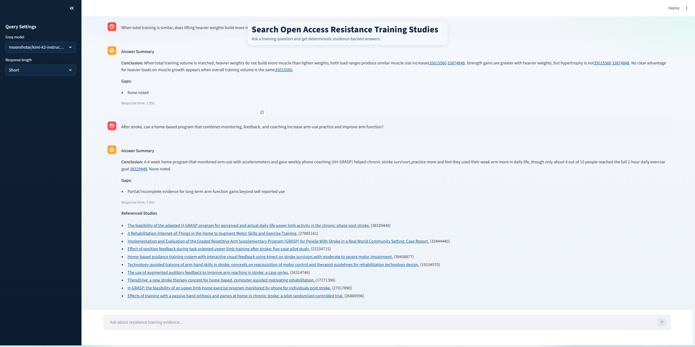

\*\*Overview\*\*


This project uses PubMed articles to answer fitness questions generated by users, and can be found at https://ask-fitness-science.streamlit.app/ .   



\*\*Key features:\*\*


\* The index currently covers 100,000 PubMed Central (PMC) abstracts related to exercise and resistance training, pulled via NLM E-utilities.  

\* Free usage of Groq LLMs   

\* Citations of studies that are used to generate a response  

\* Modern Streamlit UI  

\* Choice of models/output response size


\*\*How it works\*\* 





\*\*Data \& indexing pipeline\*\*  

In this project, I start by utilizing the ESearch and EFetch utilities provided by the National Library of Medicine to gather specific PMCIDs for studies involving exercise, fitness, and resistance training. Because PubMed has specific restrictions around scraping, and due to the ease of access for their API, it was an obvious choice.


For each ID, I scraped the abstract into a file, and that data was then converted into chunks. Because each abstract was relatively small, each one could correspond to one chunk. Those chunks were then tokenized, and converted to a FAISS index using the BAAI/bge-base-en-v1.5 model. This model performs \\~98% as well as the bge-large model, and is around 33% as large (\[Comparison of BGE Base to Large](https://bge-model.com/bge/bge\_v1\_v1.5.html)) , so I decided to use it. When attempting to use the bge-large model, Streamlit Community Cloud timed out downloading it. When using a smaller model, all-MiniLM-L6-v2, the quality significantly decreased, and the results were not feasible for a reliable model. 


After the index was built, all large artifacts were published to HuggingFace, at https://huggingface.co/datasets/coolstick/Ask-Fitness-Science . Due to GitHub's file size restrictions, it was not possible to host my data there, but for Streamlit Community Cloud, the files needed to be accessible online. After an initial load of the Streamlit webpage, speed did not decrease after switching to HuggingFace.


\*\*Retrieval\*\*   

Next, I used Streamlit to make a webpage with the application. With Streamlit's Community Cloud, it was the best choice for a free site with a modern UI. To find studies that best matched the user's query, I used a combination of dense and sparse ranking. For dense ranking, I used the BAAI/bge-base-en-v1.5 model, and for sparse ranking, I utilized the BM25 retrieval algorithm. I weighted the dense/sparse rankings, and found the top 10 studies relating to the query. Because the studies were written with a high amount of technical jargon, dense ranking had a much higher weighting. I chose the top 10 studies to balance token usage with accuracy. Because many studies pulled were similar to each other, taking only the top 5 studies limits other studies from being pulled, which may provide additional insight for the user's question. 


\*\*Generation \& citation guardrails\*\*  

For the LLM API, I decided to use Groq's free tier. This tier is generous with tokens compared to other providers, and I was satisfied with the results of certain modes. I thoroughly tested each LLM on the free tier, and finalized that groq-compound, groq-compound/mini, llama-3.3b-70b-versatile, and moonshotai/kimi-k2-instruct-0905 were the best options for my application. Because it was hosted on Streamlit Community Cloud, I was unable to use open-source models with unlimited token usage, such as qwen-30b-coder:latest. As a result, users are limited with their queries each day. Furthermore, chat history is not applied to the model to reduce token usage. Chat is shown in the UI for the current session, but not sent to the LLM and not saved between sessions. Users can choose a model from the four provided, and also specify an output length.


To ensure accuracy with the LLM's response, I prompted it to only take information from the studies at hand. This limits responses when questions are not directly addressed, but ensures accuracy. Furthermore, due to the limitations of the free LLMs, it attempts to rephrase rather than simplify the studies, making the responses more difficult to comprehend for certain users.  

To ensure that the LLM did not hallucinate, I asked it to cite a source for each claim it provided.  It formatted each response into sections consisting of a conclusion and gaps in the research. Instead of asking the LLM to cite studies on its own, I instead asked it to cite studies in order, e.g. \\<Study 1\\>. That way, links would be formatted correctly, and the LLM had less room to hallucinate studies that didn't exist. After the LLM response was returned, I formatted its response, converted the citations to links, and added a 'Relevant Studies' section to list each study that was pulled in the top 10\\.


\*\*Evaluation\*\*  

To grade accuracy, I created a few scripts in grade\\\_data that calculated metrics for accuracy and validity in my responses. To begin, I pulled 53 studies and generated two questions for each study, then generated metrics to determine the percentage of studies that were found for each question. Due to the considerable overlap of studies in the dataset, many studies were not found. 


\*\*Top-K study recall (percent and fraction): the percent/fraction of queries where the source study is in the top-K results.\*\*


| Method | k \\= 5 | k \\= 10 | k=20 |

| :---- | :---- | :---- | :---- |

| \*\*Dense\*\* | 49/106 (46.23%) | 53/106 (50%) | 60/106 (56.6%) |

| \*\*Sparse\*\* | 11/106 (10.38%) | 11/106 (10.38%) | 15/106 (14.15%) |

| \*\*Fused\*\* | 50/106 (47.17%) | 54/106 (50.94%) | 58/106 (54.72% |


I tested the BAAI/bge-reranker-base reranker with my models, and the metrics for the above table did not increase by more than 1.89%. As a result, due to the increased computational power it would require, I did not include it in my final model. 


I labeled a miss as “still helpful” if the top-10 set contained at least one study that supported a helpful answer. Using this rubric, 52/52 misses still had a useful match in the top 10\\.


Of the 106 questions, 102 (96.2%) were found to have a satisfactory response that cited sources and were faithful to the studies generated.


50% of the answers took \\<= 29.52 seconds to generate, and 95% took \\<= 55.14 seconds. These times are significantly lower when using models from the Groq API


\*\*Run locally\*\*  

```

&nbsp;git clone https://github.com/coolstick784/Ask-Fitness-Science.git \&\& cd Ask-Fitness-Science  

&nbsp; python \\-m venv .venv \&\& . .venv/bin/activate  \\# Windows: .venv\\\\Scripts\\\\activate  

&nbsp; pip install \\-r requirements.txt  

&nbsp; export GROQ\\\_API\\\_KEY=YOUR\\\_KEY HF\\\_TOKEN=YOUR\\\_HF\\\_TOKEN  \\# PowerShell: $env:GROQ\\\_API\\\_KEY="..."; $env:HF\\\_TOKEN="..."  

&nbsp; streamlit run app/app.py  

```

\*\*Run locally (rebuild everything)\*\*  

```

git clone https://github.com/coolstick784/Ask-Fitness-Science.git \&\& cd Ask-Fitness-Science  

&nbsp; python \\-m venv .venv \&\& . .venv/bin/activate  \\# Windows: .venv\\\\Scripts\\\\activate  

&nbsp; pip install \\-r requirements.txt  

&nbsp; export HF\\\_TOKEN=YOUR\\\_HF\\\_TOKEN  \\# PowerShell: $env:HF\\\_TOKEN="YOUR\\\_HF\\\_TOKEN"  

&nbsp; python pipeline/run\\\_pipeline.py \\--publish-to-hf \\--hf-repo-id \\<REPO ID HERE\\>  

```

\*\*Limitations \& safety\*\*  

\\- Tokens are limited to Groq's free API usage  

\\- Chat history is not saved for future queries  

\\- Technical jargon is not simplified  

\\- Studies not in PubMed's Open Access database are not available  

\\- Non-studies are not available to scrape  

\\- This does not provide medical advice  

\\- There is a lot of overlap in studies, so not all relevant studies are always pulled  

\\- Abstracts may miss details from the full text


